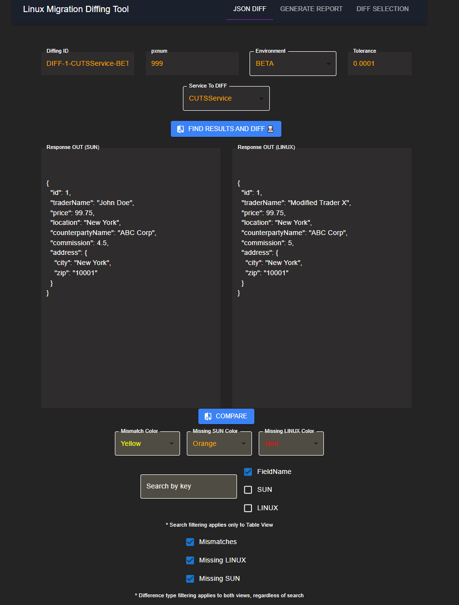
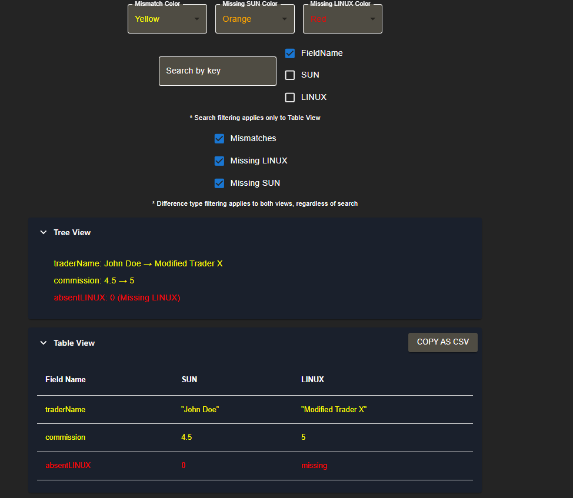
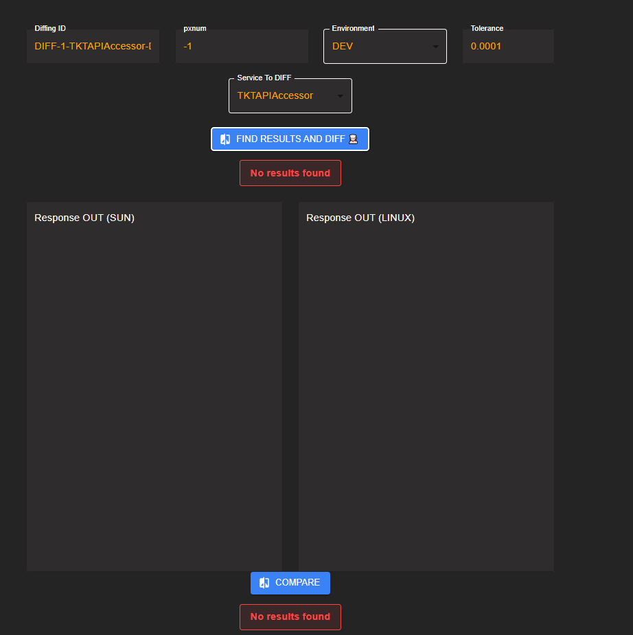
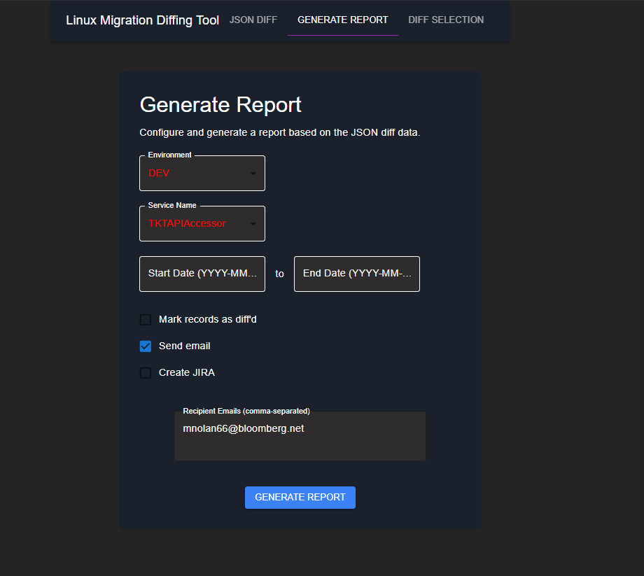
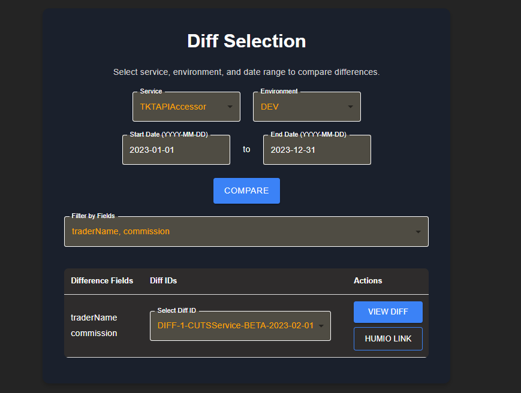
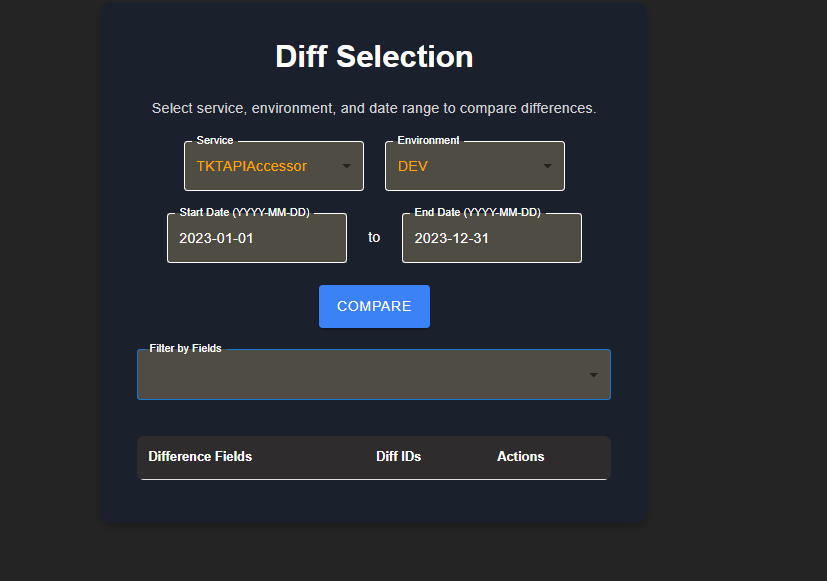
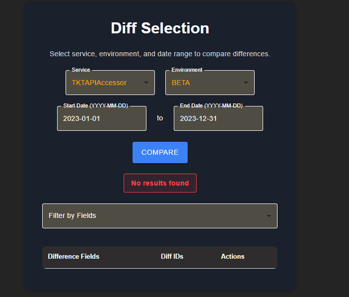

# TOMS Linux Migration Tool POC

The purpose of this is to highlight the future of the diffing tool currently being leveraged by ticketing for TKTAPIAccessor migration. The primary weaknesses of the current tool are as follows:

1. No segregation by pxnum or any other attribute.
2. Must wait a day for JIRA reports to be manually run.
3. Timing of reports dictated by JOBM.
4. Current tool isn't the most reliable.
5. No interface to view diffs, must rely on JIRA ticket creation.
6. Must rely on automated emails for important diffing information.
7. No way to visualize all diffs, only a subset.

This extension of the diffing tool will address all of those points by providing a UI interface to explore diffs.

## Functionality

**IMPORTANT** Currently, all data is mocked and hard coded (as this is a POC). You can find the hard coded data under `/src/services/dataServices.ts`

The first page on the website allows for you to enter in a query where you can customize the following:
1. Diff ID 
2. pxnum (optional)
3. Environment
4. tolerance
+ This is used to configure floating point comparrisons between two records. 
5. Service to DIFF 

Click **Find Results and DIFF** to get the result for the record (assuming one exists)



From there, you can view the diff in a `tree` and or `table` format 

You can also customize the colors of the respective diffs. For example, all mismatches between records are `yellow` whereas absent records for `LINUX` are `red`



If no records are found, we will notify the user of such



Next, you can generate a `Diff report` on the fly for a given service and time range

This report will generate the `email report` we currently generate, which contains

1. fields that were diffed 
2. how often a field was different



To replace the JIRA, we will allow for a dynamic diff viewer where you can load diffs on the fly!

To do so, an interface exists that will allow for the user to enter in the target:
1. `service`
2. `environment`
3. `time range`

From here, we will generate a mapping of `different fields` to `diff id`. 

You can filter based on what fields you want included (by default all fields are included, so feel free to exclude whatever you don't want)

Clicking `VIEW DIFF` will take you back to the first page and load the diff in for you. 

Clicking `HUMIO LINK` will open up a humio link on a seperate tab with information relating to the request that caused the diff+







## Next steps

1. Agree on front end functionality with various TOMS teams
2. `migrate diffing infrastructure` to a BAS service to allow for `on demand diffing`
3. Deploy website on `BPAAS` 

## Running Locally

To run this project locally, follow these steps:

### Prerequisites
Ensure you have the following installed (should be installed with bootstrapper):

1. **Node.js** (version 16 or higher)  
   Install from [here](https://nodejs.org/).

2. **npm** (Node Package Manager)  
   npm comes bundled with Node.js, so installing Node.js will also install npm.

3. **Tailwind CSS** (optional if not preconfigured, as it may already be integrated in the project)

4. **Git**  
   Install Git from [here](https://git-scm.com/).

### Setup

1. **Clone the repository:**
   ```bash
   git clone git@github.com:maximosnolan/diff.git
   json-diff-viewer
   ```

2. **Install dependencies:**
   Make sure you are in the root directory of your project, then run the following command to install all required packages:
   ```bash
   npm install
   ```

3. **Set up Tailwind CSS (if not preconfigured):**
   If your project doesn't already include Tailwind CSS, you can set it up by following the instructions in the [Tailwind CSS Docs](https://tailwindcss.com/docs/installation) for a React project. 

4. **Start the development server:**
   Once the dependencies are installed, you can start the React development server using the following command:
   ```bash
   npm start
   ```
   This will launch the project in your default browser at `http://localhost:5173/`.

### Optional Steps

- **Building for production:**  
   If you want to build a production-ready version of the project, use:
   ```bash
   npm run build
   ```
   This will create an optimized version of your app in the `build` folder.

- **Running Tailwind CSS in watch mode:**  
   If you’re editing Tailwind styles locally, make sure to run the following in a separate terminal window to watch for changes and rebuild the Tailwind CSS styles automatically:
   ```bash
   npm run dev
   ```

### Troubleshooting

- **If you get a "module not found" error:**  
   Ensure all dependencies are installed correctly. You can try deleting the `node_modules` folder and the `package-lock.json` file, then re-run `npm install`.

- **Issues with Tailwind CSS not being applied:**  
   Check that the Tailwind configuration (`tailwind.config.js`) is set up properly, and that your CSS files are correctly importing Tailwind's base styles (usually in `index.css` or `App.css`).

If nothing else works, please reach out to `Maximos Nolan` 